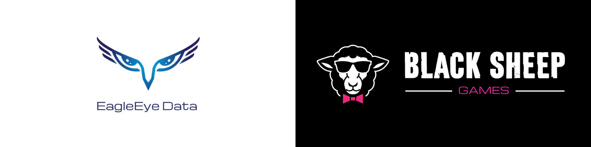

# EagleEye Data
</img>
A Black Sheep Games uma empresa nova de desenvolvimento de jogos entrou em contato com a EagleEye Data em busca de dados que direcione a criação dos seus primeiros jogos para que sejam um sucesso, utilizamos a maior plataforma de distribuição de jogos para PC para que isso fosse possivel.

# Sobre
Projeto desenvolvido para conclusão do modulo 3 do Bootcamp Resilia Educação, trabalhando em equipe utilizamos os dados da steam para alcançar o objetivo de nosso cliente ficticio, utilizamos dashbords para ilustrar os dados capturados do banco de dados.
## table of contents
<!--ts-->
   * [Installation](#installation)
   * [Usage](#usage)
      * [STDIN](#stdin)
   * [Colaboradores](#Team)
<!--te-->
# Team
- <a href="https://github.com/BarbaraGuimaraes21">Barbara Guimarães</a>
- <a href="https://github.com/elicadv">Elica Dias</a>
- <a href="https://github.com/est8r">Ester Messias</a>
- <a href="https://github.com/Henry-Januario">Henry Januario</a>
- <a href="https://github.com/igorsans">Igor Santos</a>