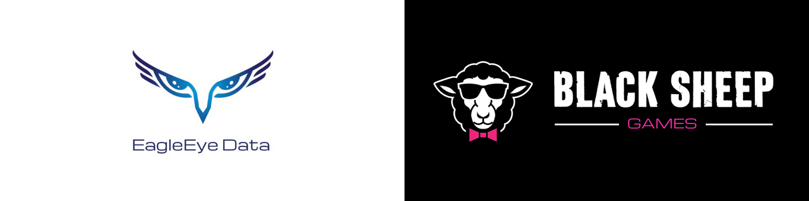
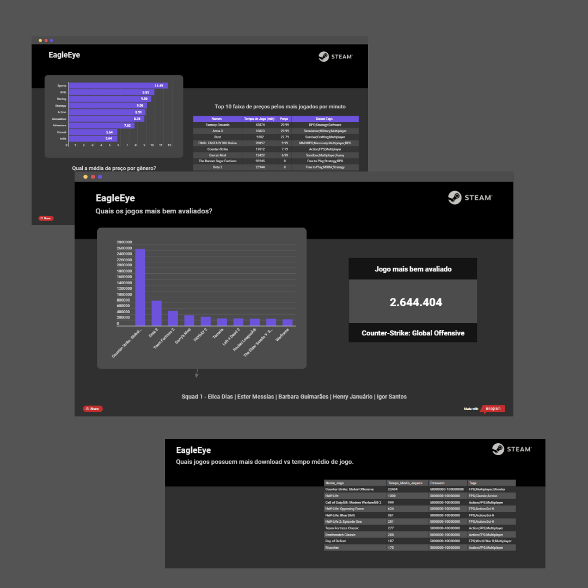

# EagleEye Data
</img>
A Black Sheep Games uma empresa nova de desenvolvimento de jogos entrou em contato com a EagleEye Data em busca de dados que direcione a criação dos seus primeiros jogos para que sejam um sucesso, utilizamos a maior plataforma de distribuição de jogos para PC para que isso fosse possivel.

# Sobre
Projeto desenvolvido para conclusão do modulo 3 do Bootcamp Resilia Educação, trabalhando em equipe utilizamos os dados da steam para alcançar o objetivo de nosso cliente ficticio, utilizamos dashbords para ilustrar os dados capturados do banco de dados.

# Dashbord
Utilizamos de dashboards pra ilustrar os dados retornados das buscas realizadas para que o cliente tenha uma direção para realizar suas metas.
<a href="https://infogram.com/9f066796-86ac-4488-877a-8c465fe91058" style="color:#989898!important;text-decoration:none!important;" target="_blank"></img>
EagleEye Dashboard</a>

## Apresentação
A apresentação desses dados e sua importancia para o cliente foram apresentados em uma reunião.

</img>
# Team
- <a href="https://github.com/BarbaraGuimaraes21">Barbara Guimarães</a>
- <a href="https://github.com/elicadv">Elica Dias</a>
- <a href="https://github.com/est8r">Ester Messias</a>
- <a href="https://github.com/Henry-Januario">Henry Januario</a>
- <a href="https://github.com/igorsans">Igor Santos</a>

</img>

## table of contents
<!--ts-->
   * [EagleEye-Data](#EagleEye-Data)
   * [About](#About)
      * [Dashbord](#Dashbord)
      * [Presentation](#Presentation)
   * [Team](#Team)
<!--te-->
# EagleEye-Data
The Black Sheep Games, a new game development company contacted us in search of data that guide the creation of your first games for them to be a success we use the largest distribution platform for PC games to make this possible.

# About
Project developed to complete module 3 of Bootcamp "Resilia Educação", working as a team we use steam data to achieve the objective of our fictitious client, we use dashbords to illustrate the data captured from the database.

## Dashbord
We use dashboards to illustrate the data returned from searches so that the customer has a direction to achieve their goals.
## Presentation
The presentation of this data and its importance to the client were presented at a meeting.